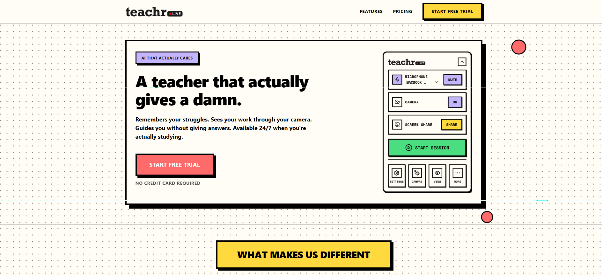
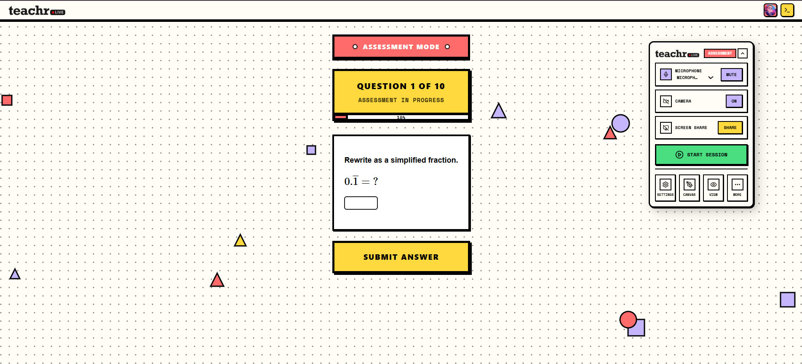

<div align="center">

# 🎓 Teachr — AI Teaching Assistant Module

### *An AI that actually gives a damn.*

**Remembers your struggles. Sees your work. Guides without giving answers. Available 24/7.**

---

[](https://python.org)
[](https://fastapi.tiangolo.com)
[](https://reactjs.org)
[](https://pinecone.io)
[](https://mongodb.com)
[](https://ai.google)

</div>

---

## 🌟 What Is This?

This repository is the **Teaching Assistant Module** of a larger AI-native educational platform. It is not a chatbot — it is a fully architectured AI tutor that *thinks* between sessions, *remembers* across weeks, and *speaks* in real time through a voice-first multimodal interface.

The core character is **Adam** — an AI tutor designed to be present the way a great human teacher is: aware of your emotional state, your academic gaps, what you left unfinished last time, and even the time of day you tend to be most focused.

> **This module is one part of a much larger AI education system. What you see here is the full Teaching Assistant layer — the brain, the memory, and the voice.**

---

## 📸 Screenshots

<div align="center">

**Landing Page — Teachr Live**



**Assessment Mode — Live Session**



</div>

---

## 🧠 Core Architecture

The Teaching Assistant module is composed of **four interconnected subsystems**, each engineered independently and wired together through a clean async event pipeline:

```
┌─────────────────────────────────────────────────────────────────────────────┐
│                         TEACHING ASSISTANT MODULE                           │
│                                                                             │
│   ┌──────────────┐    ┌──────────────┐    ┌──────────────┐                 │
│   │  Speech-to-  │    │  RAG Memory  │    │   Skills &   │                 │
│   │   Speech     │───▶│   Pipeline   │───▶│  Injection   │                 │
│   │   (Adam)     │    │  (Pinecone)  │    │  Engine      │                 │
│   └──────────────┘    └──────────────┘    └──────────────┘                 │
│          │                   │                    │                         │
│          └───────────────────┴────────────────────┘                         │
│                              │                                              │
│                   ┌──────────▼──────────┐                                  │
│                   │  Event Loop (async)  │                                  │
│                   │   MongoDB Sessions   │                                  │
│                   └─────────────────────┘                                  │
└─────────────────────────────────────────────────────────────────────────────┘
```

---

## 🗣️ Speech-to-Speech — Live Voice Tutoring

The frontend is built on a real-time, low-latency, bidirectional speech-to-speech connection — capable of sustained multimodal conversation with camera awareness and screen sharing.

### How It Works

1. **Microphone input** is streamed as raw audio chunks from the browser using `AudioWorkletProcessor` running in a dedicated Web Worker — eliminating main-thread blocking.
2. Audio is sent to the **Live API** via WebSocket as base64-encoded PCM data at 16kHz.
3. Adam's audio response streams back in real time, decoded and played through `AudioContext` using a synchronized playback queue.
4. Simultaneously, a **transcript** of both sides of the conversation is captured and forwarded to the **TeachingAssistant API** via WebSocket for memory processing.

### What Adam Can See
- 📸 **Camera feed** — Adam sees your face, your workspace, your whiteboard
- 🖥️ **Screen share** — Adam can see what you're working on, your code, your equations
- 🎙️ **Live microphone** — Full-duplex voice without push-to-talk
- 📊 **Live assessment panel** — Questions can be injected mid-session

The frontend sends these as interleaved multimodal streams, with the media type encoded in each message frame.

---

## 🧩 RAG Memory System

This is the technical centerpiece of the module. Rather than relying on a chat window's context length, Adam has **true long-term memory** that persists across sessions — scored, deduplicated, and surfaced intelligently at retrieval time.

### Memory Schema

Each memory is a strongly-typed object stored in Pinecone with four namespaces:

| Namespace | Purpose |
|-----------|---------|
| `academic` | What the student understands, struggles with, or has mastered |
| `personal` | Schedule, interests, personal context |
| `preference` | How the student likes to learn, pace, communication style |
| `context` | Session-level context, unfinished threads, key moments |

Each `Memory` carries: `text`, `importance` (0.0–1.0), `counter` (reinforcement count), `first_epoch`, `last_epoch`, and rich `metadata` (emotion, topic, valence, category).

### The Extraction Pipeline

```
Every 3 conversation turns
         │
         ▼
┌──────────────────────────────────────────────┐
│              MemoryExtractor                  │
│  (Multimodal LLM, single-batch extraction)   │
│                                              │
│  Input:  3 exchanges (user + Adam turns)     │
│  Output: memories[], emotions[], moments[],  │
│          unfinished_topics[]                  │
└──────────────────────────────────────────────┘
         │
         ▼
┌──────────────────────────────────────────────┐
│              MemoryStore (Pinecone)           │
│                                              │
│  1. Semantic dedup check (cosine ≥ 0.92)    │
│  2a. Duplicate → UPDATE counter + importance │
│  2b. Unique → UPSERT with embedding         │
│  3. Mirror write to local JSON backup        │
└──────────────────────────────────────────────┘
```

Memories are never blindly appended. Before any write, the system performs a **semantic deduplication check** — if a memory with cosine similarity ≥ 0.92 already exists, the system *updates* the existing entry (incrementing its reinforcement counter) rather than creating a duplicate. This keeps the vector index clean across dozens of sessions.

### The Retrieval Pipeline — Two Stages

#### Stage 1: TA-Light (Per Turn)

On every user message, an LLM first decides **whether retrieval is even needed** (avoiding wasteful Pinecone queries on "ok", "thanks", "yes"). If retrieval is needed, it generates an **optimized search query** — not just the raw user text — tuned to find the most semantically relevant memories.

```
User Message
     │
     ▼
┌─────────────────────────────────────────┐
│  Light Retrieval Analysis (LLM)         │
│  → need_retrieval: true/false           │
│  → retrieval_query: "<optimized query>" │
│  → reasoning: "<explanation>"           │
└─────────────────────────────────────────┘
     │ if need_retrieval = true
     ▼
Pinecone search (all namespaces, top-10)
     │
     ▼
3-Factor Relevance Scoring
  = 0.6 × vector_similarity
  + 0.3 × recency_score         ← decays over 24h, weighted by frequency
  + 0.1 × importance_score
```

#### Stage 2: TA-Deep (Every 3 Minutes)

Every 3 minutes of active conversation, a **deep multi-type retrieval** runs in parallel across all 4 memory namespaces simultaneously using a thread pool, using an LLM-synthesized thematic query that reflects the arc of the recent conversation — not just the last message.

#### Reflection Layer — The Bridge to Adam

Retrieved memories don't get dumped directly into the prompt. They pass through a **Reflection Layer** — a final LLM call that asks: *"Given these memories and this conversation, is there anything Adam should actually act on?"* Only if the answer is yes does the system generate a concise, natural-language **system instruction** injected into Adam's live context.

```
Retrieved Memories + Conversation Context
              │
              ▼
    ┌─────────────────────┐
    │  Reflection Layer   │
    │   (Multimodal LLM)  │
    └─────────────────────┘
              │
    ┌─────────┴─────────┐
    │                   │
  "NONE"          Instruction
    │                   │
  (skip)         Inject into Adam
                via SSE / WebSocket
```

### Session Closing & Opening Context

When a session ends, the system doesn't just close — it **prepares for next time**:

1. **Closing artifacts** are generated: session summary, goodbye message, next-session hooks, emotional arc
2. **Opening memory** is generated and saved to MongoDB: a personalized greeting context that includes:
   - A `welcome_hook` referencing a specific achievement from last session
   - A `suggested_opener` — Adam's first line — crafted from unfinished topics and emotional state
   - A `personal_relevance` note — contextual to the day of the week and time of day
   - A `last_session_summary` for continuity

This means Adam's very first sentence when you return is already warm, specific, and informed.

---

## 🎯 Adaptive Question Engine — DASH

Most quiz apps show you random questions. We built something entirely different.

The **DASH (Deep Additive State History)** engine — grounded in cognitive science research by Mozer & Lindsey — models every student as a living, evolving learner with a measurable **memory strength** for each individual skill. Questions are not picked randomly. They are *chosen* through a multi-stage decision process that accounts for what the student knows, what they're forgetting, and exactly how hard to push them right now.

### The Science Behind It

DASH treats learning as a **memory decay problem**, not a checkbox problem. Every skill has:
- A **memory strength** (continuous value, not binary pass/fail)
- A **forgetting rate** (how fast that skill fades without practice)
- A **prerequisite graph** (mastery gates that must hold before harder content unlocks)

The probability of answering a question correctly is modeled as:

```
P(correct) = sigmoid(memory_strength − skill_difficulty)
             = 1 / (1 + exp(−(M − d)))
```

Memory strength **grows** with each correct answer (with diminishing returns as mastery increases) and **decays exponentially** with time when left unpracticed. A wrong answer penalizes both the target skill *and* its prerequisite chain.

### How Questions Are Selected — Step by Step

```
Student answers a question
          │
          ▼
┌─────────────────────────────────────────────────────────────┐
│  1. SKILL RECOMMENDATION ENGINE                             │
│                                                             │
│  For every skill in the curriculum:                         │
│  • Calculate decayed P(correct) at current time             │
│  • Check all prerequisites recursively                      │
│  • Recommend if P < 0.7 AND all prerequisites ≥ 0.7        │
│  • Sort by: grade_level → order_in_grade → P(correct)       │
│             (lowest grade, most fundamental, hardest first) │
└─────────────────────────────────────────────────────────────┘
          │
          ▼
┌─────────────────────────────────────────────────────────────┐
│  2. ADAPTIVE DIFFICULTY ANALYSIS                            │
│                                                             │
│  Analyze last 5 answers:                                    │
│  • correctness_rate × 0.6 → correctness_score              │
│  • avg_time / expected_time × 0.4 → time_score             │
│  • Combined → performance_score (−1.0 to +1.0)             │
│                                                             │
│  STRUGGLING     → difficulty_adjustment = −0.30             │
│  SLIGHTLY_LOW   → difficulty_adjustment = −0.15             │
│  BALANCED       → difficulty_adjustment =  0.00             │
│  SLIGHTLY_HIGH  → difficulty_adjustment = +0.15             │
│  EXCELLING      → difficulty_adjustment = +0.30             │
└─────────────────────────────────────────────────────────────┘
          │
          ▼
┌─────────────────────────────────────────────────────────────┐
│  3. QUESTION SELECTION FROM BANK                            │
│                                                             │
│  • Pull candidate questions for the recommended skill       │
│  • Filter by: not recently seen, difficulty within range    │
│  • Serve the question with full Perseus rendering metadata  │
│  • If primary skill is exhausted, expand to grade range     │
└─────────────────────────────────────────────────────────────┘
```

### Cold-Start Intelligence

A new student has no history. Rather than dumping them at Grade 1 or forcing a lengthy placement test, the system:

1. Infers their grade from registration
2. Automatically seeds all **prior-grade skills** with `memory_strength = 1.0` (skipping already-known content)
3. Restricts the first 20 questions to a **±1 grade band** — close enough to challenge, not enough to overwhelm
4. After 20 questions, full DASH intelligence kicks in across the entire curriculum

### What This Looks Like in Practice

| Scenario | What Happens |
|----------|-------------|
| Student answers 5 in a row correctly, faster than expected | System detects EXCELLING → shifts to harder questions |
| Student takes >3 minutes on a question | Time penalty applied to memory update — same correct answer gives less credit |
| Student gets a Grade 8 question wrong | Memory strength penalized on the target skill **and** its prerequisite chain |
| Student hasn't practiced fractions in 2 weeks | Decay function drops P(correct) below threshold → fractions resurface |
| All recommended skills are exhausted | System expands to full grade range, still excluding mastered topics |
| Prerequisite not mastered | Skill is **locked** — student is routed to foundational content first |

### The Question Bank

Questions are served in **Perseus format** — the same open-source question format used by Khan Academy — supporting:

- Multiple choice with LaTeX rendering
- Numeric input with fraction support
- Expression input with symbol keyboards
- Hints (multi-step, not just answer reveals)

The question bank is stored in **MongoDB** (`questions_db`), organized as a hierarchy:

```
Region (US)
  └── Course (e.g., "Algebra 1")
        └── Unit (e.g., "Linear equations") ← mapped as a Skill
              └── Lesson (e.g., "One-step equations") ← mapped as a Sub-skill
                    └── Exercise ← groups of questions
                          └── Question (Perseus item) ← served to student
```

At startup, the DASH system builds an in-memory index mapping every question ID to its parent unit (skill) using a **batch $in query** — not one query per question — making cold initialization fast even across tens of thousands of items. Questions themselves are lazy-loaded on-demand with an LRU cache (cap: 10,000 items).

---

## ⚡ Event Processing Engine

The Teaching Assistant runs a **continuous async event loop** that processes a queue of real-time events — transcripts, audio, screen captures, media frames — and drives all downstream memory and skill processing.

```python
# Simplified event loop
async def ongoing(self):
    while self.running:
        events = self.queue_manager.dequeue_batch(max_batch_size=50)
        for event in events:
            self.context_manager.update_from_event(event)
            if event.type == 'text' and event.data['speaker'] == 'user':
                # Trigger async memory retrieval (debounced)
                asyncio.create_task(self._trigger_memory_retrieval_async(...))
                # Trigger async memory extraction (batched every 3 turns)
                asyncio.create_task(self._extract_memories_async(...))
            # Run skills against current context
            injections = self.skills_manager.execute_skills(context)
            for injection in injections:
                await self.injection_manager.send_to_adam(injection, ...)
```

Key engineering decisions:
- **Fire-and-forget async tasks** for all memory operations — no user waits for Pinecone
- **Debounced retrieval** — prevents redundant queries on rapid user input
- **Write-Behind context sync** — contexts are held in memory and flushed to MongoDB periodically
- **LRU eviction** on both MemoryStore handles (max 100 users) and MemoryRetriever sessions (max 50)
- **Circuit breaker** on LLM calls — auto-recovers after 60 seconds of failure

---

## 👁️ Student Monitoring — What the System Tracks

Beyond conversation, the module tracks rich session signals:

| Signal | How |
|--------|-----|
| **Screen activity** | Frontend WebRTC screen capture → WebSocket → Event pipeline |
| **Camera feed** | Browser `getUserMedia` → multimodal stream → Multimodal Live API |
| **Conversation turns** | Transcript via WebSocket → ContextManager → MongoDB |
| **Inactivity** | SessionMonitor checks last activity timestamp, triggers re-engagement prompts |
| **Credit consumption** | CostTracker middleware wraps all LLM calls; per-session token accounting |
| **Emotional state** | Extracted per exchange batch, tracked as `emotional_arc` across full session |
| **Unfinished topics** | Extracted at session end, surfaced at next session start |

---

## 🏗️ System Architecture — Services

This module runs as part of a multi-service backend, all orchestrated by `run_tutor.ps1`:

| Service | Port | Role |
|---------|------|------|
| `TeachingAssistant API` | 8002 | Core memory, sessions, SSE injection, WebSocket feed |
| `DASH API` | 8000 | Question bank, assessments, curriculum engine |
| `SherlockED API` | 8001 | Content search, topic resolution, video finder |
| `Auth Service` | 8003 | Google OAuth, JWT issuance and validation |
| `Frontend (Vite/React)` | 3000 | Multimodal Live UI, assessment panels, screen share |

All services share:
- **`MongoDB Atlas`** — user profiles, sessions, opening memory, cost tracking
- **`Pinecone`** — per-user vector indexes (`memory-{user_id}`) for long-term memory
- **`Shared auth middleware`** — JWT validation across all FastAPI services
- **`Shared logging config`** — structured, unified log format across services

---

## 🔁 The Simulator

The `Simulator.py` is a developer tool for **seeding Adam's memory** without a live conversation. It replays pre-scripted conversation sessions from markdown files and routes them through the real WebSocket API — triggering the full memory extraction, deduplication, and closing-context pipeline.

Two modes:
- **`automatic`** — Runs all session files sequentially, generates memories hands-free
- **`interactive_mixed`** — Adam's lines come from JSON, user can type custom responses in terminal

Use `--clean` to wipe a user's Pinecone index before starting fresh.

---

## 🚀 Quick Start

### Prerequisites
- Python 3.10+ with virtualenv (`env/`)
- Node.js 18+
- MongoDB Atlas URI
- Pinecone API Key + Project
- Google AI (Multimodal LLM) API Key

### 1. Configure Environment

Copy `.env.example` to `.env` and fill in all keys:

```env
GEMINI_API_KEY=...
PINECONE_API_KEY=...
PINECONE_ENVIRONMENT=us-east-1-aws
PINECONE_INDEX_NAME=aitutor-memories
EMBEDDING_DIMENSION=1024
MONGODB_URI=mongodb+srv://...
MONGODB_DB_NAME=aitutor
GOOGLE_CLIENT_ID=...
GOOGLE_CLIENT_SECRET=...
JWT_SECRET=...
```

### 2. Run Everything

```powershell
# Windows PowerShell (run once to allow scripts)
Set-ExecutionPolicy -ExecutionPolicy Bypass -Scope Process

# Start all services
.\run_tutor.ps1
```

This starts all 5 services and opens the frontend at `http://localhost:3000`.

### 3. Seed Adam's Memory (Optional)

```bash
python services/TeachingAssistant/Simulator.py --user-id your_user_id --mode automatic
```

---

## 📁 Key Files

```
services/TeachingAssistant/
├── teaching_assistant.py      # Core TA class — memory, event loop, session lifecycle
├── api.py                     # FastAPI app — REST + WebSocket + SSE endpoints
├── session_manager.py         # MongoDB session CRUD, credit tracking
├── skills_manager.py          # Dynamic skill loading and execution
├── Simulator.py               # Developer memory-seeding simulator
│
├── Memory/
│   ├── schema.py              # Memory dataclass + MemoryType enum
│   ├── vector_store.py        # Pinecone CRUD — upsert, dedup, 3-factor search
│   ├── extractor.py           # LLM-powered memory extraction (per batch)
│   ├── retriever.py           # TA-light + TA-deep retrieval + Reflection Layer
│   └── consolidator.py        # Session closing: emotional arc, hooks, opening context
│
├── core/
│   ├── context_manager.py     # In-memory context store with write-behind sync
│   ├── event_processor.py     # Routes events to skills
│   ├── config.py              # Centralized env-driven configuration
│   └── decorators.py          # @with_retry, @with_circuit_breaker
│
└── skills/
    └── greeting.py            # Session start/end prompt generation
```

---

## 🔬 Technical Highlights

| What | How |
|------|-----|
| **No context window reliance** | Pinecone vector DB as persistent long-term memory |
| **Semantic deduplication** | Cosine similarity ≥ 0.92 → update instead of insert |
| **3-factor memory scoring** | 60% similarity + 30% recency + 10% importance |
| **Recency decay** | Half-life of 24h, combined with reinforcement frequency |
| **Async-first** | All I/O runs via `asyncio.create_task` or `loop.run_in_executor` |
| **Managed thread pool** | `ThreadPoolExecutor` for Pinecone and file I/O |
| **LRU eviction** | Both memory stores and retriever sessions are LRU-bounded |
| **Circuit breaker** | 5-failure threshold, 60s recovery — protects against LLM instability |
| **Debounced retrieval** | Min 30s between retrieval calls per session — no query flooding |
| **Write-behind sync** | Context written to MongoDB every 30s — not per-event |
| **Token tracking** | Every LLM call tagged with session + call type for cost attribution |

---

## 🛡️ Security

- **JWT authentication** on all API endpoints and WebSocket connections
- **Google OAuth** as identity provider (no passwords stored)
- **CORS** locked to configured allowed origins only
- **GZip compression** on all responses ≥ 1KB
- **Request timeouts** (30s general, 60s for token usage queries)
- **Observer WebSocket** — separate authenticated channel for monitoring sessions

---

<div align="center">

---

*Built with care, curiosity, and the belief that AI tutors should feel more human than most humans.*

**— Yash Gondaliya**

</div>
